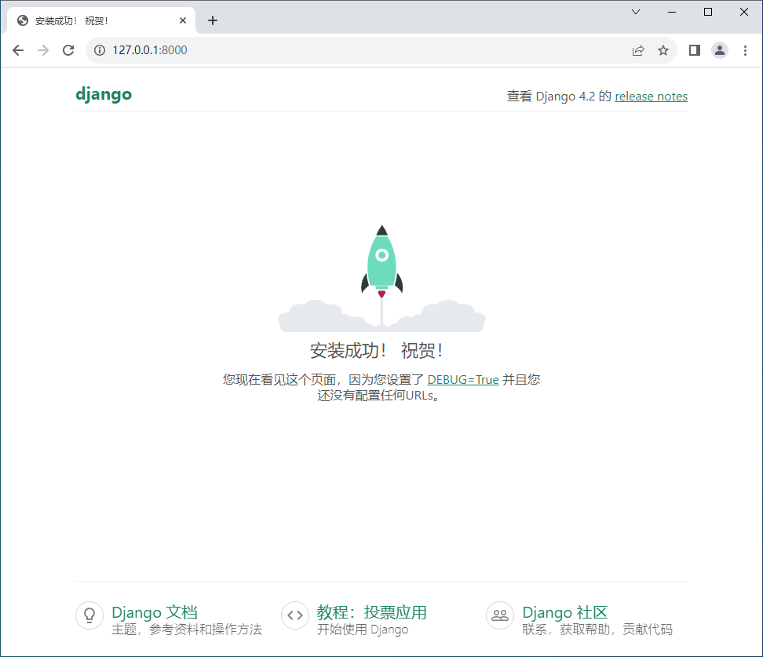

# 一、安装 Django 依赖

## 1.1、安装命令

```
pip install Django==4.2.5
```

## 1.2、安装日志

```
(.venv) H:\workspaces\dragon-framework-workspaces\dragon-framework-Py.django>pip install Django==4.2.5
Looking in indexes: https://mirrors.aliyun.com/pypi/simple/
Collecting Django==4.2.5
  Downloading https://mirrors.aliyun.com/pypi/packages/bf/8b/c38f2354b6093d9ba310a14b43a830fdf776edd60c2e25c7c5f4d23cc243/Django-4.2.5-py3-none-any.whl (8.0 MB)
     ---------------------------------------- 8.0/8.0 MB 3.6 MB/s eta 0:00:00
Collecting backports.zoneinfo
  Downloading https://mirrors.aliyun.com/pypi/packages/78/cc/e27fd6493bbce8dbea7e6c1bc861fe3d3bc22c4f7c81f4c3befb8ff5bfaf/backports.zoneinfo-0.2.1-cp38-cp38-win_amd64.whl (38 kB)
Collecting sqlparse>=0.3.1
  Downloading https://mirrors.aliyun.com/pypi/packages/98/5a/66d7c9305baa9f11857f247d4ba761402cea75db6058ff850ed7128957b7/sqlparse-0.4.4-py3-none-any.whl (41 kB)
     ---------------------------------------- 41.2/41.2 kB 658.4 kB/s eta 0:00:00
Collecting asgiref<4,>=3.6.0
  Downloading https://mirrors.aliyun.com/pypi/packages/9b/80/b9051a4a07ad231558fcd8ffc89232711b4e618c15cb7a392a17384bbeef/asgiref-3.7.2-py3-none-any.whl (24 kB)
Collecting tzdata
  Downloading https://mirrors.aliyun.com/pypi/packages/d5/fb/a79efcab32b8a1f1ddca7f35109a50e4a80d42ac1c9187ab46522b2407d7/tzdata-2023.3-py2.py3-none-any.whl (341 kB)
     ---------------------------------------- 341.8/341.8 kB 7.1 MB/s eta 0:00:00
Collecting typing-extensions>=4
  Downloading https://mirrors.aliyun.com/pypi/packages/24/21/7d397a4b7934ff4028987914ac1044d3b7d52712f30e2ac7a2ae5bc86dd0/typing_extensions-4.8.0-py3-none-any.whl (31 kB)
Installing collected packages: tzdata, typing-extensions, sqlparse, backports.zoneinfo, asgiref, Django
Successfully installed Django-4.2.5 asgiref-3.7.2 backports.zoneinfo-0.2.1 sqlparse-0.4.4 typing-extensions-4.8.0 tzdata-2023.3

[notice] A new release of pip available: 22.1.2 -> 23.2.1
[notice] To update, run: python.exe -m pip install --upgrade pip

(.venv) H:\workspaces\dragon-framework-workspaces\dragon-framework-Py.django>
```

## 1.3、验证结果

```
(.venv) H:\workspaces\dragon-framework-workspaces\dragon-framework-Py.django>python -m django --version
4.2.5

(.venv) H:\workspaces\dragon-framework-workspaces\dragon-framework-Py.django>
```

# 二、创建 Django 项目

## 2.1、创建命令

```
django-admin startproject webapp
```

## 2.2、创建日志

```
(.venv) H:\workspaces\dragon-framework-workspaces\dragon-framework-Py.django>django-admin startproject webapp

(.venv) H:\workspaces\dragon-framework-workspaces\dragon-framework-Py.django>
```

## 2.3、文件说明

```
├─ web/                 # 外层的 web/ 目录是项目的容器，目录名称对 Django 没有影响，你可以将它重命名为任何你喜欢的名称。
│  ├─ manage.py         # 一个让你用各种方式管理 Django 项目的命令行工具。
│  ├─ webapp/           # 内层的 webapp/ 目录包含你的项目，它是一个纯 Python 包。它的名字就是当你引用它内部任何东西时需要用到的 Python 包名。
│  │  ├─ __init__.py    # 一个空文件，告诉 Python 这个目录应该被认为是一个 Python 包。
│  │  ├─ asgi.py        # 作为你的项目运行在 ASGI 兼容的 Web 服务器上的入口。
│  │  ├─ wsgi.py        # 作为你的项目运行在 WSGI 兼容的 Web 服务器上的入口。
│  │  ├─ settings.py    # Django 项目配置文件。
│  │  ├─ urls.py        # Django 项目路由声明。
```

==PS：防止包名冲突，已将外层 webapp 名称改成 web==

# 三、启动 Django 项目

## 3.1、启动命令

```
python manage.py runserver                 # 启动命令
python manage.py runserver 8000            # 启动命令（指定端口）
python manage.py runserver 0.0.0.0:8000    # 启动命令（指定IP+端口）
```

## 3.2、启动日志

```
(.venv) H:\workspaces\dragon-framework-workspaces\dragon-framework-Py.django\web>python manage.py runserver 0.0.0.0:8000
Watching for file changes with StatReloader
Performing system checks...

System check identified no issues (0 silenced).

You have 18 unapplied migration(s). Your project may not work properly until you apply the migrations for app(s): admin, auth, contenttypes, sessions.
Run 'python manage.py migrate' to apply them.
September 30, 2023 - 23:11:11
Django version 4.2.5, using settings 'webapp.settings'
Starting development server at http://0.0.0.0:8000/
Quit the server with CTRL-BREAK.
```

## 3.3、启动结果

 

# 四、创建 Django 应用

## 4.1、创建命令

```
python manage.py startapp index
```

## 4.2、创建日志

```
(.venv) H:\workspaces\dragon-framework-workspaces\dragon-framework-Py.django\web>python manage.py startapp index

(.venv) H:\workspaces\dragon-framework-workspaces\dragon-framework-Py.django\web>
```

